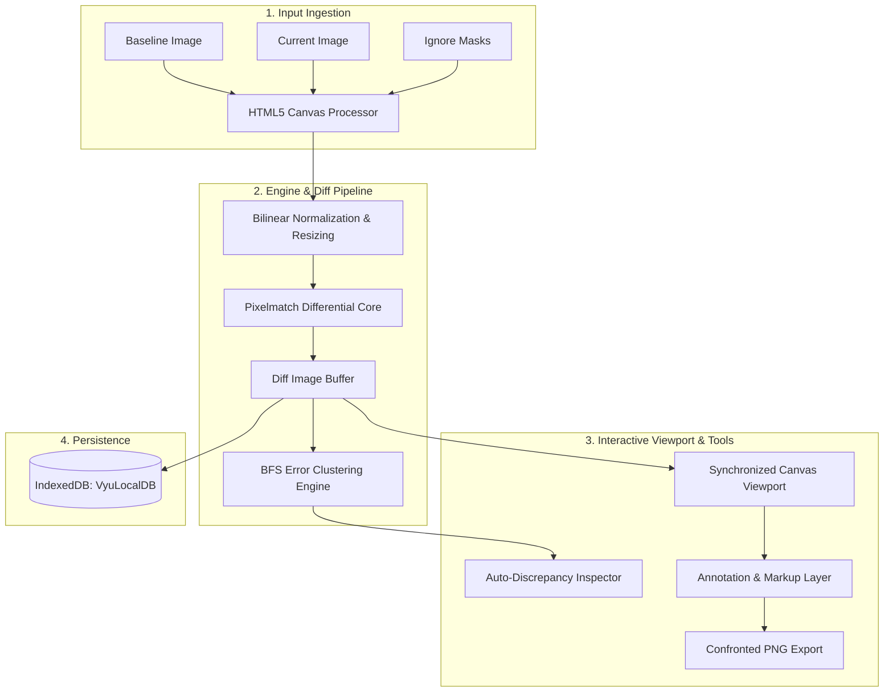

# Vyú - Visual Regression Workspace 👁️⚡

[](https://opensource.org/licenses/MIT)
[](https://nodejs.org/)
[](https://www.docker.com/)
[](https://pages.github.com/)
[](https://conventionalcommits.org)

*Read this in other languages: [Español](README.md) | [English](README.en.md)*

**Vyú** is a high-performance visual regression workspace and pixel-by-pixel differential inspection tool. Designed for frontend engineers, UI/UX designers, and QA automation teams, Vyú offers client-side differential computation via Pixelmatch, synchronized multi-viewport zoom & pan, custom exclusion masks (Ignore Zones), automatic error clustering (BFS bounding boxes), design annotation tools, and confronted export capabilities.

---

## 🌟 Key Features

| Feature | Description |
| :--- | :--- |
| **Triple Synchronized Viewport** | Simultaneous inspection across **Base (V1)**, **Current (V2)**, and **Diff** with pixel-perfect lockstep zoom & pan. |
| **Interactive Split Slider** | Swipe mode with high-precision drag handle to identify layout displacement and component shifts. |
| **Opacity Overlay (Onion Skin)** | Variable alpha layer blending (0% to 100%) to spot subtle shadow and gradient shifts. |
| **Client-Side Differential Engine** | Fast, privacy-preserving in-browser computation with custom sensitivity threshold, anti-aliasing filter, and neon highlight palettes. |
| **Exclusion Masks (Ignore Zones)** | Draw rectangular ignore regions to omit dynamic widgets (timestamps, animated carousels, ads) from the diff calculation. |
| **Automatic Error Clustering** | Connected-component clustering (BFS) automatically isolates and quantifies regression areas into selectable bounding boxes. |
| **Annotation & QA Markup Suite** | Vector pencil, rectangles, circles, text notes with adaptive scale, click-to-delete eraser, and select-and-drag manipulation. |
| **Confronted Comparison Export** | One-click generation of a unified side-by-side PNG report embedding all annotations and metadata headers. |
| **Zero-Cloud Local Persistence** | Fully offline IndexedDB storage (`VyuLocalDB`) with complete state restoration (images, parameters, and metadata). |

---

## 🏗️ Architecture & Processing Pipeline



---

## 🚀 Quick Start

### 1. Local Execution (Node.js)

#### Prerequisites
* **Node.js**: v18.0.0 or higher
* **npm**: v8.0.0 or higher

```bash
# Clone the repository
git clone https://github.com/cristian-haro/vyu.git
cd vyu

# Install dependencies
npm install

# Start the static local server
npm start
```

Open your browser at **`http://localhost:3000`**.

---

### 2. Docker Execution

Vyú is containerized with lightweight Alpine Linux:

```bash
# Build the Docker image
docker build -t vyu .

# Run the container
docker run -d -p 3000:3000 --name vyu-workspace vyu

# Check logs
docker logs -f vyu-workspace
```

---

## ⌨️ Shortcuts & Hotkeys

| Key / Shortcut | Action |
| :--- | :--- |
| `Space` *(Hold)* | Quick Pan mode (switches cursor to grab without losing active drawing tool) |
| `Ctrl + Z` / `Cmd + Z` | Undo last drawn annotation |
| `Delete` / `Backspace` | Remove selected annotation shape |
| `Mouse Wheel` | Synchronized zoom centered at cursor |
| `Mouse Drag` | Synchronized viewport panning (in Pan mode or with Space pressed) |

---

## 🧪 Cross-Platform Compatibility Matrix

| Platform / Browser | Engine | Status | Notes |
| :--- | :--- | :--- | :--- |
| **Google Chrome / Chromium** (Win/macOS/Linux) | Blink | ✅ Verified | Hardware-accelerated canvas rendering |
| **Mozilla Firefox** (Win/macOS/Linux) | Gecko | ✅ Verified | Full IndexedDB & Blob lifecycle support |
| **Apple Safari** (macOS/iOS) | WebKit | ✅ Verified | HiDPI / Retina canvas density handled |
| **Microsoft Edge** (Windows) | Blink | ✅ Verified | Native performance |
| **Mobile Browsers** (Chrome/Safari) | Blink/WebKit | ✅ Verified | Responsive layout & touch-action enabled |

---

## 🤝 Contribution & Conventional Commits

We enforce the [Conventional Commits](https://www.conventionalcommits.org/en/v1.0.0/) specification. All commit messages must follow this structure:

```text
<type>(<scope>): <short summary>

[optional body]

[optional footer(s)]
```

### Commit Types:
* `feat`: A new feature or capability.
* `fix`: A bug fix.
* `docs`: Documentation updates.
* `style`: Code style / formatting changes (no logic changes).
* `refactor`: Code refactoring without behavioral changes.
* `perf`: Performance optimization.
* `test`: Adding or correcting tests.
* `chore`: Build tasks, package updates, maintenance.

---

## 📄 License

This project is licensed under the [MIT License](LICENSE).
