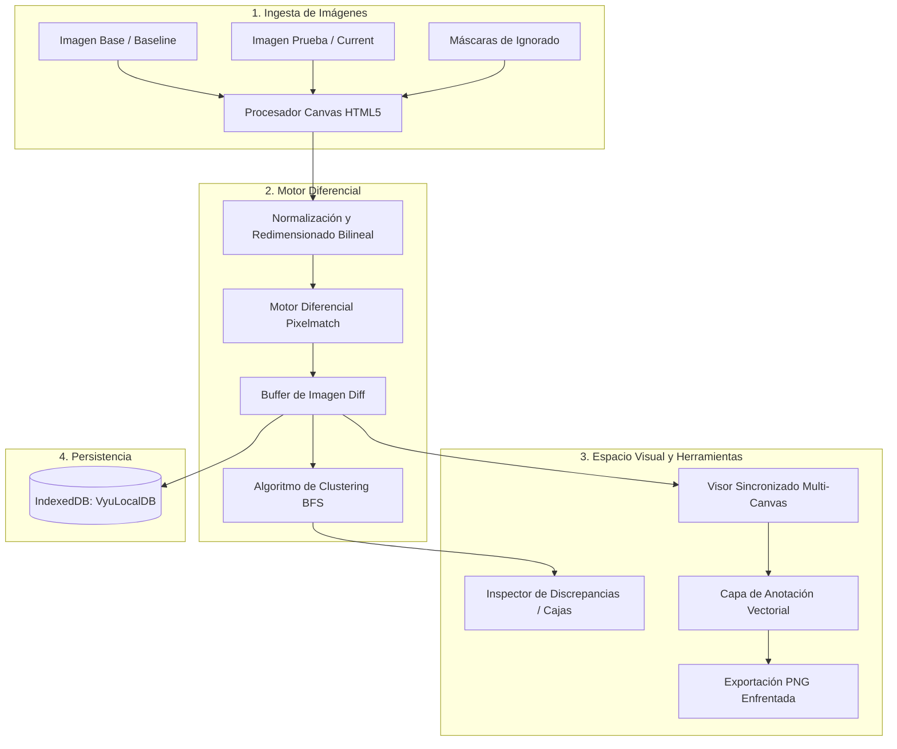

# Vyú - Workspace de Regresión Visual 👁️⚡

[](https://opensource.org/licenses/MIT)
[](https://nodejs.org/)
[](https://www.docker.com/)
[](https://pages.github.com/)
[](https://conventionalcommits.org)

*Leer en otros idiomas: [Español](README.md) | [English](README.en.md)*

**Vyú** es un espacio de trabajo interactivo de alto rendimiento para inspección visual y análisis de regresiones píxel a píxel. Diseñado para ingenieros frontend, diseñadores UI/UX y equipos de control de calidad (QA), Vyú ofrece cálculo diferencial en el navegador mediante Pixelmatch, visualizadores sincronizados con zoom y paneo milimétrico, máscaras de exclusión (Zonas Ignoradas), detección automática de discrepancias con algoritmo de clustering BFS, herramientas completas de anotación y exportación de comparativas enfrentadas.

---

## 🌟 Características Principales

| Característica | Descripción |
| :--- | :--- |
| **Visualizador Triple Sincronizado** | Inspección en paralelo de **Base (V1)**, **Current (V2)** y **Diff** con zoom y paneo sincronizados al píxel. |
| **Split Slider (Swipe Interactivo)** | Modo cortina con deslizador central de alta precisión para detectar desalineaciones y desplazamientos de maquetación. |
| **Opacity Overlay (Onion Skin)** | Superposición con transparencia variable (0% a 100%) para detectar variaciones sutiles de sombreado y gradientes. |
| **Motor Diferencial en Cliente** | Procesamiento seguro y privado en navegador con umbral de sensibilidad configurable, filtro anti-aliasing y paletas neón. |
| **Máscaras de Exclusión (Zonas Ignoradas)** | Dibuja zonas rectangulares para omitir elementos dinámicos (fechas, carruseles, banners de anuncios) del cálculo de diff. |
| **Clustering Automático de Errores** | Algoritmo BFS que aísla y cuantifica automáticamente cada área de regresión en cajas delimitadoras interactivas. |
| **Suite de Anotación y QA** | Lápiz vectorial, rectángulos, círculos, notas de texto con auto-escalado, borrador por clic y selección/arrastre de marcas. |
| **Descarga de Comparativa Enfrentada** | Exportación con un clic de un reporte PNG consolidado lado a lado con todas las anotaciones y metadatos superpuestos. |
| **Persistencia 100% Local (IndexedDB)** | Almacenamiento seguro en `VyuLocalDB` sin subidas a la nube, con restauración completa de imágenes, marcas y parámetros. |

---

## 🏗️ Arquitectura y Flujo de Procesamiento



---

## 🚀 Guía de Inicio Rápido

### 1. Ejecución Local con Node.js

#### Prerrequisitos
* **Node.js**: v18.0.0 o superior
* **npm**: v8.0.0 o superior

```bash
# Clonar el repositorio
git clone https://github.com/cristian-haro/vyu.git
cd vyu

# Instalar dependencias
npm install

# Iniciar el servidor local
npm start
```

Abre tu navegador e ingresa a **`http://localhost:3000`**.

---

### 2. Ejecución con Docker

Vyú incluye empaquetado optimizado en contenedor Alpine Linux:

```bash
# Construir la imagen Docker
docker build -t vyu .

# Iniciar el contenedor en segundo plano
docker run -d -p 3000:3000 --name vyu-workspace vyu

# Ver los logs del contenedor
docker logs -f vyu-workspace
```

---

## ⌨️ Atajos de Teclado y Gestos

| Atajo / Tecla | Acción |
| :--- | :--- |
| `Barra Espaciadora` *(Mantener)* | Modo Paneo Rápido (cambia temporalmente el cursor a mano sin perder la herramienta de dibujo activa) |
| `Ctrl + Z` / `Cmd + Z` | Deshacer la última anotación realizada |
| `Supr` / `Delete` / `Backspace` | Eliminar la forma o nota seleccionada |
| `Rueda del Mouse` | Zoom sincronizado centrado en la posición del cursor |
| `Arrastre de Mouse` | Paneo sincronizado en el visor (en modo Mover o con Espacio presionado) |

---

## 🧪 Matriz de Compatibilidad Multiplataforma

| Plataforma / Navegador | Motor | Estado | Notas |
| :--- | :--- | :--- | :--- |
| **Google Chrome / Chromium** (Win/macOS/Linux) | Blink | ✅ Verificado | Aceleración por hardware en canvas 2D |
| **Mozilla Firefox** (Win/macOS/Linux) | Gecko | ✅ Verificado | Soporte completo para IndexedDB y Blob URLs |
| **Apple Safari** (macOS/iOS) | WebKit | ✅ Verificado | Manejo correcto de densidad de píxeles Retina / HiDPI |
| **Microsoft Edge** (Windows) | Blink | ✅ Verificado | Rendimiento nativo óptimo |
| **Navegadores Móviles** (Chrome/Safari) | Blink/WebKit | ✅ Verificado | Interfaz responsiva con soporte táctil |

---

## 🤝 Contribución y Commits Convencionales

Seguimos la especificación de [Conventional Commits](https://www.conventionalcommits.org/es/v1.0.0/). Cada commit debe seguir la estructura:

```text
<tipo>(<alcance>): <descripción corta>

[cuerpo opcional]

[pie opcional]
```

### Tipos de Commit Permitidos:
* `feat`: Nueva característica o funcionalidad.
* `fix`: Corrección de errores.
* `docs`: Cambios en la documentación.
* `style`: Ajustes visuales de código/estilos sin cambio lógico.
* `refactor`: Refactorización de código sin alterar comportamiento.
* `perf`: Mejoras de rendimiento.
* `test`: Adición o corrección de pruebas.
* `chore`: Tareas de build, dependencias o mantenimiento.

---

## 📄 Licencia

Este proyecto está bajo la [Licencia MIT](LICENSE).
